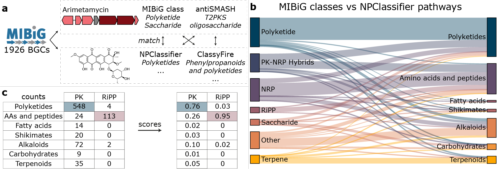

# mibig_classifications
Series of jupyter notebooks and scripts to retrieve chemical classes (ClassyFire/NPClassifier), as well as BGC classifications for MIBiG BGCs and their products.
These two types of classifications are then connected to eachother by counting their interactions, ideally matching certain chemical and BGC classes. Based on the relative counts of each matched pair of class-terms it is assessed how well the pair of class-terms match to eachother. These matched classes can then be used to rule out unreliable BGC-compound matches, as is done in the NPClassScore method implemented in the [NPLinker framework](https://github.com/sdrogers/nplinker/). Read about it [here](https://www.researchsquare.com/article/rs-1391827/v1?redirect=/article/rs-1391827)!




## Environment
To run the code in this repo, set up an environment like this using conda:
```
conda create -n myenv python=3.7.2 rdkit
conda install -c plotly plotly=4.14.3
conda install -c plotly plotly-orca==1.3.1 psutil
conda activate myenv
pip install jupyter
```

To run the analysis from this repo, you will need to download a version of [MIBiG](https://mibig.secondarymetabolites.org/) (json format), like [here](https://dl.secondarymetabolites.org/mibig/mibig_json_2.0.tar.gz).


## Citation
[Louwen, J. J. R., Medema, M. H., & van der Hooft, J. J. J. (2022). Enhanced correlation-based linking of biosynthetic gene clusters to their metabolic products through chemical class matching.](https://www.researchsquare.com/article/rs-1391827/v1?redirect=/article/rs-1391827)

## Acknowledgements
We would like to thank Oscar Hoekstra for his initial efforts (https://github.com/OscarHoekstra/ClassifyNPDB)
